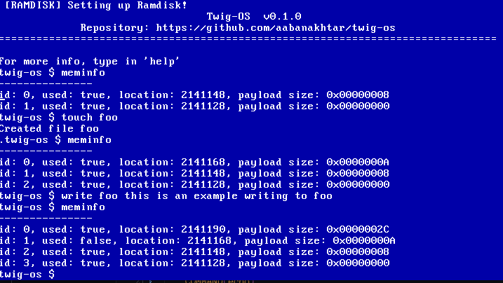

# Twig OS



Twig is a 32-bit protected mode, single-tasking operating system built for educational purposes. It is written in C and x86 Assembly and provides a minimal environment to understand low-level systems programming.

## Features

### Shell

- VGA text-mode interface
- Basic shell with built-in commands:
  - `about`, `clear`, `reboot`, `echo`, `ls`, `cat`, `touch`, `write`, `rm`, `help`, ```meminfo```

### Core System

- Multiboot-compliant bootloader
- GDT and IDT setup
- IRQ remapping and keyboard driver (Scancode Set 0)

### Memory Management

- Custom hybrid bump + freelist allocator
- ```alloc()``` and ```free()``` api
- Defined heap using linker symbols

### Ramdisk Filesystem

- In-memory file storage
- 32 files, each up to 4KB
- Shell support for viewing, creating, and modifying files

### Utilities

- Custom string and ring buffer implementations
- Minimal kernel runtime (no C stdlib)

### TODO

* multitasking? Framebuffer graphics? we'll see i guess.

## Requirements

- Cross-compiler: [`i686-elf-gcc`](https://github.com/lordmilko/i686-elf-tools)
- QEMU: `qemu-system-i386`
- Netwide Assembler (nasm)

## Building and Running

```sh
make clean
make build
make run
```


```````
